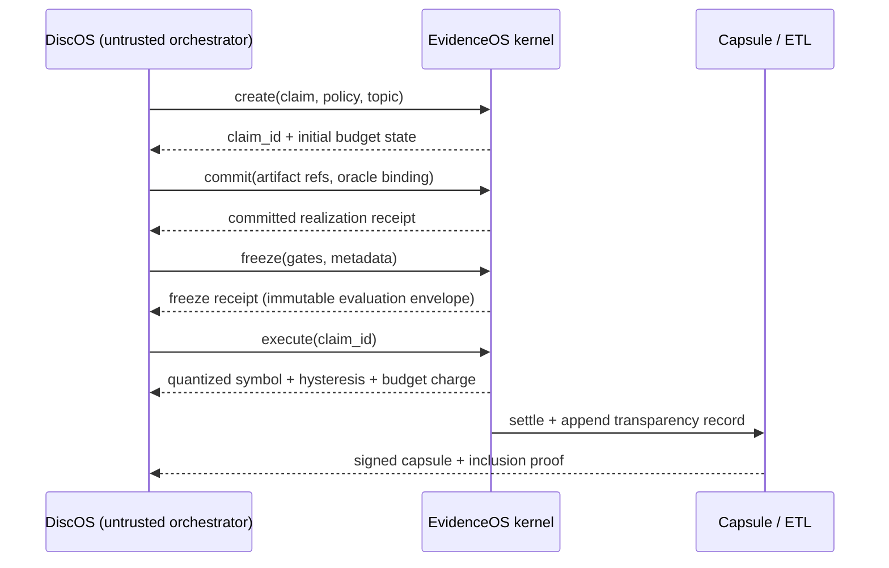

# Threat Model Walkthrough: Outsider Anchor (Black-Box, End-to-End)

This walkthrough explains one concrete attack and one concrete defense path without requiring protocol internals.

## 1) Threat in one sentence

**Adaptive probing leaks holdout labels and decision boundaries when an evaluation service returns reusable feedback over many rounds.**

## 2) Baseline system (oracle returns raw metric)

Assume a standard evaluation service:

- Input: candidate artifact `x` from an external orchestrator (DiscOS/userland).
- Hidden state: holdout dataset `H` that the candidate must never directly reveal.
- Response: raw scalar metric such as `accuracy(x, H) = 0.8437`.

From the outside, this looks reasonable: one float per query, no raw labels exposed.

## 3) Attacker method (bit-flip / boundary-probe)

The attacker does not need internals. They only need repeated access.

1. Start with baseline candidate `x0`; query oracle and record score `s0`.
2. Apply tiny mutation `m1` (for example a one-feature or one-rule bit flip), producing `x1`.
3. Query again, observe `s1`, and compute `Δ1 = s1 - s0`.
4. Keep mutations that improve score; reject those that hurt.
5. Repeat adaptively: each query is chosen using all previous scores.
6. Near thresholds, run paired probes to map local decision boundaries.
7. Across many rounds, reconstruct information about hidden labels/regions of `H` well enough to overfit or exfiltrate structure.

This is black-box extraction: no source code, no direct label dumps, only iterative metric feedback.

## 4) What the attacker observes

In a naive setup, the attacker can collect more than the explicit float:

- **Payload channel:** high-precision metric values over time (the primary leakage path).
- **Error channel:** distinct validation errors that reveal parser/schema state.
- **Timing channel:** response latency differences between near-equivalent probes.
- **Budget signaling (if weak):** soft warnings before hard blocks can leak margin-to-limit.

Even when each single response appears harmless, the full transcript can carry substantial signal.

## 5) Same interaction through EvidenceOS (black-box interface)

EvidenceOS keeps the same high-level user journey (submit and evaluate), but wraps execution in four kernel invariants.

### 5.1 Canonical realization

- Requests are canonicalized before evaluation.
- Equivalent representations collapse to one normalized form.
- Effect: removes representation-level wiggle room and replay tricks that inflate transcript signal.

### 5.2 Quantization + hysteresis

- Raw metrics are not returned as free-form floats.
- Outputs are quantized into coarse buckets.
- Hysteresis stalls small local moves: if a mutation is below threshold, attacker receives the **same bucket** as before.
- Effect: repeated local probing loses gradient-like resolution.

### 5.3 Budget charging + transcript cap

- Every emitted symbol is charged against leakage budget.
- Charging composes over the whole interaction transcript (not just a single call).
- Once limits are reached, further extraction attempts no longer increase information yield.

### 5.4 Fail-closed behavior

- Invalid inputs or unsafe execution paths are rejected without partial data release.
- Limit crossings halt or freeze progress instead of returning richer diagnostics.
- Effect: no “best effort” fallthrough that leaks extra bits during failure handling.

## 6) Observed outcome

Under this interface, adaptive probing no longer provides a high-resolution optimization loop:

- Local boundary scans mostly map to unchanged buckets.
- Distinguishable symbols are finite and metered.
- Transcript growth is bounded by policy caps.

**Result:** the attack collapses toward chance-level extraction or becomes uneconomical within the bounded transcript budget.

## 7) Scope boundaries (explicit non-goals)

EvidenceOS constrains kernel-mediated oracle leakage. It does **not** by itself protect against:

- Endpoint/host compromise (runtime memory tampering, privileged malware).
- Stolen signing or service keys.
- Hardware/physical side channels.
- Any direct bypass that exposes holdout artifacts outside the kernel path.

## Sequence diagram (DiscOS ↔ EvidenceOS ↔ capsule/ETL)

## One-page takeaway

- **Core attack:** repeated, adaptive metric queries can leak holdout structure.
- **EvidenceOS defense:** canonicalization, quantized+hysteretic outputs, transcript-budget accounting, and fail-closed halting.
- **Limit:** it is a verification kernel control plane, not a substitute for host/key/hardware security.
