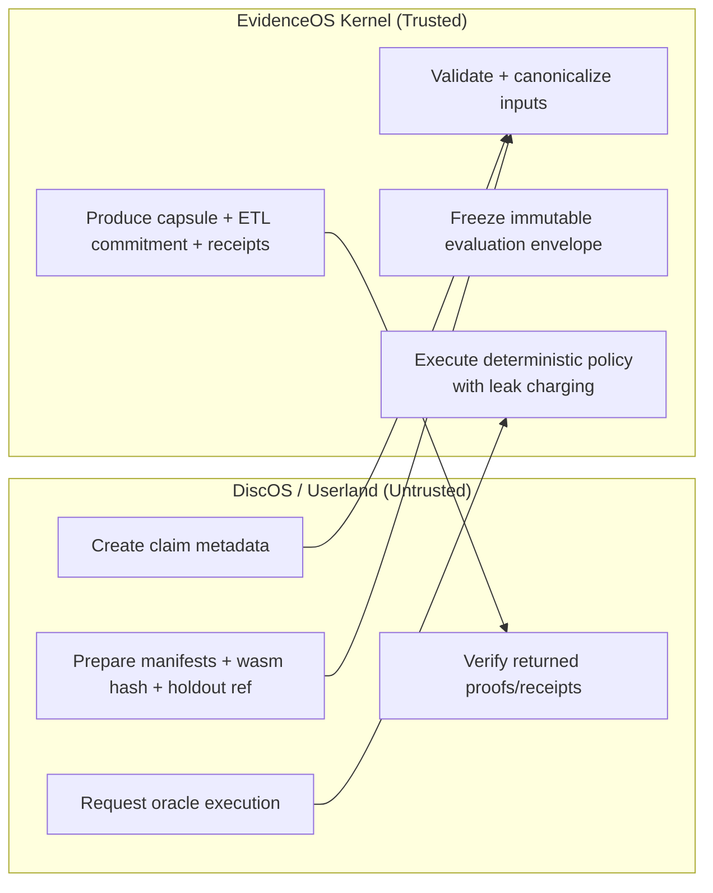

# UVP Black-Box API (Inputs/Outputs Only)

This page describes EvidenceOS as a **narrow verification service boundary**. It focuses on what you submit, what the trusted kernel guarantees, and what artifacts you can verify afterward.

For an end-to-end walkthrough, see the worked example in [Threat Model Walkthrough](threat_model_worked_example.md) (CODEX-D20 context). For formal background, see the UVP paper/citation links in the repository [Research & Citation](../README.md#research--citation) section and DOI [10.5281/zenodo.18685556](https://doi.org/10.5281/zenodo.18685556).

## Trust boundary (DiscOS vs EvidenceOS)

- **DiscOS / client-side orchestration (untrusted):** chooses claims, packages artifacts, requests oracle execution, and consumes outputs.
- **EvidenceOS kernel (trusted):** validates inputs, canonicalizes committed state, enforces deterministic execution policy, meters leakage, and fails closed.

## You provide

At the interface boundary, you submit references and commitments—not internal kernel logic:

1. **Claim metadata**
   - Claim identity/context, topic/policy knobs, and oracle request configuration.
2. **WASM module hash**
   - Cryptographic digest of the evaluation module to bind execution to a concrete binary.
3. **Artifact manifests**
   - Canonical references for inputs/outputs and supporting evidence (by digest/URI as policy allows).
4. **Holdout reference**
   - Opaque pointer/handle to the holdout dataset/material under protected handling rules.
5. **Requested oracle**
   - The oracle mode/symbol space you want the kernel to evaluate under configured constraints.

## Kernel guarantees

EvidenceOS treats these as service-level invariants of the trusted boundary:

1. **Determinism**
   - Same frozen claim envelope and committed artifacts produce reproducible outcomes under the same policy.
2. **Canonicalization**
   - Equivalent encodings are normalized before decisioning, collapsing representational wiggle room.
3. **Leak charging**
   - Oracle/output emissions consume metered budget so transcript-level extraction is bounded.
4. **Fail-closed execution**
   - Invalid/unsafe inputs are rejected without partial-release behavior or permissive fallback.

## You get back

The service returns a small, verifiable artifact set:

1. **Quantized decision/output**
   - Coarse oracle symbol/decision (not raw unconstrained internals).
2. **Capsule**
   - Signed execution artifact binding claim state, policy context, and produced decision.
3. **Inclusion proof / log receipt**
   - Transparency evidence (receipt/proof) that the capsule decision was appended to the append-only ETL log.

## Minimal lifecycle call list

A minimal black-box path is:

1. `CreateClaim`
2. `CommitArtifacts`
3. `CommitWasm`
4. `Freeze`
5. `Execute`
6. `FetchCapsule`

Treat this sequence as the contract surface: prepare commitments, freeze immutable state, execute once policy allows, then fetch and verify the resulting evidence artifacts.

## ETL append-only log (one-paragraph role)

The ETL log is the public accountability layer for kernel outcomes: each finalized execution is committed to an append-only history that supports independent verification via receipts/proofs and tree-head consistency checks over time. Operationally, this gives clients and auditors a tamper-evident record linking returned capsules to a globally ordered transparency transcript, so verification does not depend on trusting a single in-memory daemon response.
